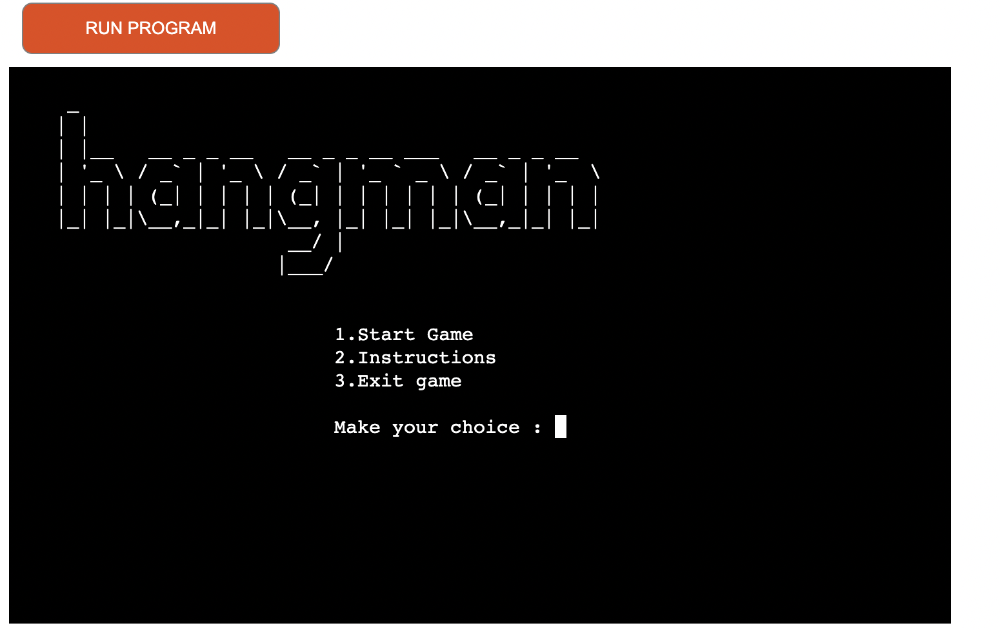
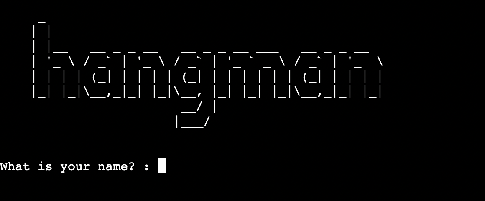
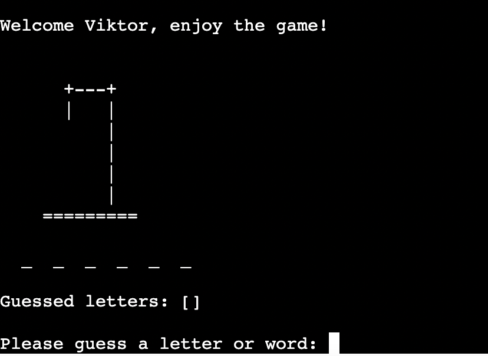

# Hangman Game

## User experience
When the user go on the website will see a hangman ASCII art and the main menu with 3 choices.

If the user choose the start game then needs to write a name to start the hangman game.

## Bugs:
1. I made an if/elif/else statement to the options if the user put different input then for example 1,2,3 it will raise an error and retry it but if the user put the wrong input the code just executed. I had to use a while loop to sort it out.
2. The letters are not swapped with the empty dashes that is why you could never win the game.

## Deployment:
1. I signed in to the heroku website where I create a new app.
2. I named it to "hangman-vm" and in the settings I set the Config Var
3. Added two buildpacks to the app. Python and NodeJS
4. Choose the deploy button and I connect my GitHub project to the heroku app
5. enabled Automatic Deploys so I can push new code to the deployed site.
6. After I choose the Deploy Branch which was created my app.
7. Here is the live link: [Hangman Game](https://hangman-vm.herokuapp.com/)