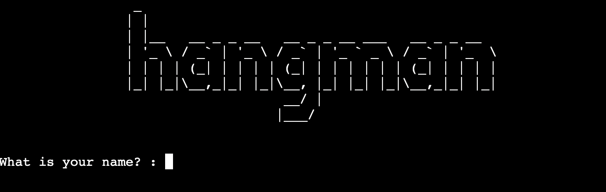
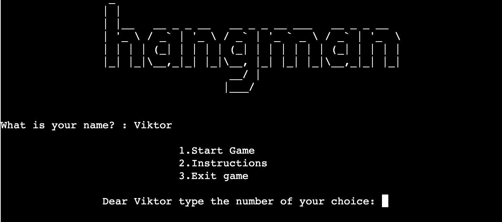
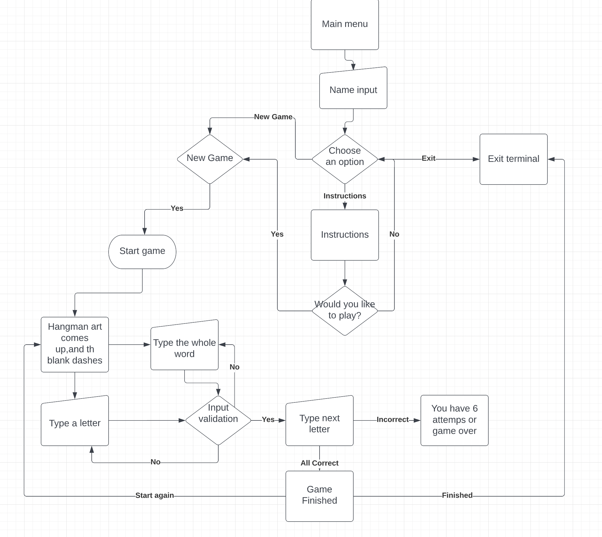

# Hangman Game

## _**Contents**_

* [User Experience](#user-experience)

* [FlowChart](#flowchart)

* [Testing](#testing)
    * [Solved Bugs](#solved-bugs)
    * [PEP8 Online Checker](#pep8-online)

* [Deployment](#deployment)

* [Credits](#credits)

## User experience:
- When the user go on the website will see a hangman ASCII art and ask for the name of the user, when the user type the name in the main menu will come with 3 choices.

- If the user choose the start game the following screen will shown where can guess a letter or the whole word. You have 6 attemps before the game is over.

- As you can see on the image if you guessed a letter it will shown in an list and you can not guess it again. If you guessed the secret word then you done a good a job and you can play again if you want to and get a new random word every time out of more than 100 words.

- Or if you could not guess the word from 6 tries then you lost, but the is always a chance to start it again just have to press Y for yes! 

- Otherwise if you do not want to play more then the game will exit from the terminal and you got a little message.

## FlowChart:

- I used Lucidchart to plan the flow of the game and how the decision make will work. You can find the link to my [Lucidchart template here](https://lucid.app/lucidchart/12c7a1ba-c80f-4678-991f-04c46a79653e/edit?viewport_loc=-181%2C19%2C3072%2C1441%2C0_0&invitationId=inv_4ee5baff-20f1-49aa-b5e0-bdd4b511fcf3#), but you need a login to see it. If you do not have a login for the Lucidchart website I share an image about it.

## Testing:

### Solved Bugs:
1. I made an if/elif/else statement to the options if the user put different input then for example 1,2,3 it will raise an error and retry it but if the user put the wrong input the code just executed. I had to use a while loop to sort it out.
2. The letters are not swapped with the empty dashes that is why you could never win the game. I had to restructure the "for" enumerate statementet to make it work.
3. When the player wanted to play again the dashed word was always the same. I had to add the random method in the startgame method.

### PEP8 Online:

- I used the PEP8 online checker to my python code and it looks all right!

## Deployment:
1. I signed in to the heroku website where I create a new app.
2. I named it to "hangman-vm" and in the settings I set the Config Var
3. Added two buildpacks to the app. Python and NodeJS
4. Choose the deploy button and I connect my GitHub project to the heroku app
5. enabled Automatic Deploys so I can push new code to the deployed site.
6. After I choose the Deploy Branch which was created my app.
7. Here is the live link: [Hangman Game](https://hangman-vm.herokuapp.com/)

## Credits:

 - I used the [Random Word Generator](https://randomwordgenerator.com/) website to make some random word.

 - I would like to say thank you to my mentor Chris Quinn to help me with my project and pushed me to the right way.

 -  For the ASCII art I used the following website: [HANGMAN-ASCII ART](https://ascii.co.uk/art/hangman)

 - The hangman art I found it on the [GitHub](https://gist.github.com/chrishorton/8510732aa9a80a03c829b09f12e20d9c). Thank you #chrishorton !
